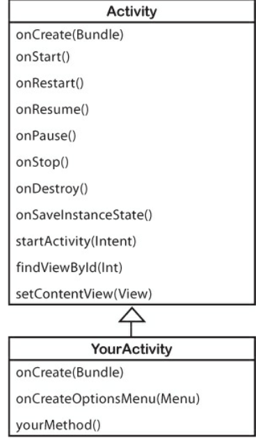
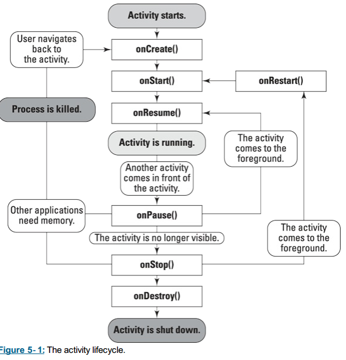
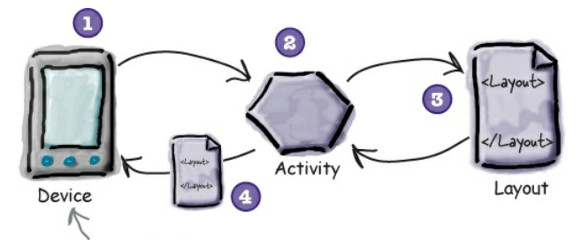

% INTRO A ANDROID

---

## Android
Es un Sistema Operativo Open-Source.  
La base de la plataforma Android es el kernel de Linux.

muchas cosas técnicas que ni yo entiendo

---

## SDK
Las herramientas del SDK (Software Development Kit) compilan el codigo, junto con los recursos y datos en un paquete de android, un .apk

Desarrollo en:  
* Java para la parte Lógica  
* XML para la parte gráfica  

---

## Views 
Son los elementos básicos de la interfaz gráfica.  
Son areas de la pantalla responsables de manejar eventos y de "*dibujar*".  
Ej: *TextView*, *ImageView*, *Layout*, *Button*.

---

## Layouts
Definen un conjunto de Views.  
Podemos definir las posiciones, apariencia y comportamiento de las mismas de dos formas:  
* Declarándolas en los layouts de XML  
* Instanciandolas en tiempo de ejecución  

---

## Activities

Se ocupan de la interacción entre el usuario y la pantalla. Son como las "páginas" de una aplicación.  

Una aplicación puede estar compuesta por una o varias activities, que trabajan independientemente y se comunican mediante mensajes (*Intent*s) que el SO recibe y envía.

---

```java
public class MainActivity extends AppCompatActivity {}  
```
  
Trabajamos con instancias de Activity, que es una clase del SDK. Entonces, nuestras activities **extienden** (son subclases de) Activity (una clase definida en el SDK), heredando métodos, atributos, y el Ciclo de Vida.
 
---



---

## Ciclo de Vida
Las Activities pasan por cuatro estados:  
*  resumed (continuada)  
*  paused  
*  stopped  
*  nonexistent  
En las transiciones entre cada estado se ejecutan el método correspondiente (*onPause*, *onResume*, etc).

---

 

---

## Uniendo todo
Cuando creamos un layout, es conveniente asignarle un "id" a cáda View para poder acceder a él desde nuestros archivos .java  

en XML:  
```XML
 		<TextView  
		android:id="@+id/texto"   
    	/>
```
en Java:  
```java
TextView texto = (TextView) findViewById(R.id.texto);  
```

---

_findViewById()_ es un método que nos permite acceder a los elementos definidos en XML a partir de sus nombres.  


---

## Interfaces
Parecidas a una "clase abstracta"
Son un "Contrato": las clases que **implementan** a una interfaz deben implementar sus métodos.  
Ej: La interfaz "animal" podría incluir métodos como "moverse", "comer", etc. Todos los animales deben implementar esos métodos, pero todos lo hacen de forma distinta. 


---

## Listeners
Esperan (*escuchan*) eventos generados por el usuario (clicks, etc.)  y ejecutan métodos como respuesta.  
Implementan interfaces pre-definidas en el SDK (aunque se pueden crear interfaces propias).  
Cada interfaz responde a un tipo de evento distinto (*OnClick*, *OnLongClick*, *onTextChange*, etc).
 
---

 Creamos un Listener:  
```java
ImageView.OnClickListener myListener=new ImageView.OnClickListener() {
        @Override
        public void onClick(View view) { 
            //Hacer algo
        }
};
```

. . .

Y lo asignamos a una View:  
```java
ImageView imagen = findViewById(R.id.imagen);
imagen.setOnClickListener(myListener);
```

---

## Como Empezar
**onCreate ()**  
Es uno de los métodos heredados de Activity, corresponde a una transición en el ciclo de vida. Es responsable de cargar el layout, obtener referencias a las Views se van a usar, y definir sus comportamientos.  
 
 --- 
  
```java
protected void onCreate(Bundle savedInstanceState) {
    super.onCreate(savedInstanceState);
    setContentView(R.layout.activity_main);
    EditText input = (EditText) findViewById(R.id.inputText);
     TextWatcher escuchaTexto = new TextWatcher() {
        @Override
        public void onTextChanged(CharSequence charSequence, int i, int i1, int i2) {
            //hacer Algo
        }
        ...
    };
    input.addTextChangedListener(escuchaTexto); 
};
```
 
---
 
## Resources  
  

#### drawable  
Almacena imagenes a las que accedemos mediante R.drawable.[nombre-sin-extension]

#### values  
Guarda strings (distintos idiomas) , definiciones de colores y estilos.
 
---
 
## Múltiples Layouts
  

Podemos definir múltiples layouts para una misma activity, y Android seleccionará el más adecuado para el dispositivo que la esté corriendo.  
Todos los layouts deben tener las mismas views con la misma Id, sino tendremos una excepción en tiempo de ejecución cuando querramos obtener referencias a una View inexistente.